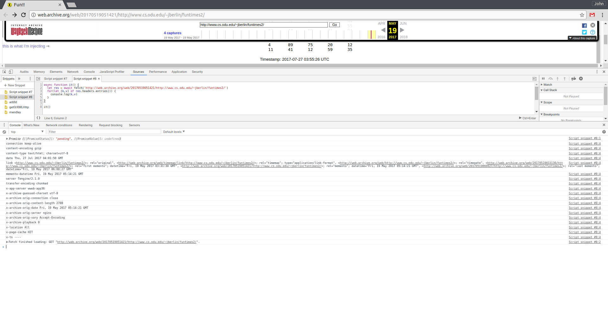

# Archival Acid Test 2.0
This repository is a follow-on study of the Archival Acid Test ([web](http://acid.matkelly.com/), [source](https://github.com/machawk1/archivalAcidTest)) that seeks to evaluate archival crawlers and replay systems for the Web.

Good Luck.

## TESTS

### Archival Acid Test 1.0 Mats
- The original Archival Acid Test ([web](http://acid.matkelly.com/), [source](https://github.com/machawk1/archivalAcidTest))
- add http://www.cs.odu.edu/~hdo/acidtest/

### Iframes
- Load pages from another/same domain on HTTP and HTTPS
- Load pages from another/same domain on HTTP and HTTPS and use [iframe page to load resources for parent page](https://github.com/N0taN3rd/archiveAcid/blob/master/docs/evalInjectedIframe2.html)
- Load page from another/same domain on HTTP and HTTPS and use it to request another html page and [rewrite links of the requested page to work in parent](https://github.com/N0taN3rd/archiveAcid/blob/master/src/cleanUpRandyHTML.js)

[Unarchivable via Internet Archive](http://web.archive.org/web/20170519051421/http://www.cs.odu.edu/~jberlin/funtimes2/), [Original](http://www.cs.odu.edu/~jberlin/funtimes2/)

### Document.domain
- Set document.domain
- http://ws-dl.blogspot.com/2017/01/2017-01-20-cnncom-has-been-unarchivable.html

### Document.cookie
- Anything to do with cookies will brick everyone!
- http://ws-dl.blogspot.com/2017/03/2017-03-09-state-of-replay-or-location.html

### Service Worker
- Only HTTPS
- Can communicate with page its working with. postMessage maybe rewritten :stuck_out_tongue_closed_eyes:
- Foreign fetch
- Intercept requests and rewrite to lw

https://n0tan3rd.github.io/replay_test/

### Fetch API
The fetch api will hit CORS almost all the time
- Request requiring auth
- Request to another domain on same parent domain that would require CORS negotitation
- Request for content type that would require CORS negotitation
- Fetch in general

### JS XHR Libs
- Axios http://ws-dl.blogspot.com/2017/03/2017-03-09-state-of-replay-or-location.html

### HTTP/1.1 and HTTP/2 with HTTPS Tests
- Requests using GET, POST, HEAD, OPTIONS, PUT, DELETE, PATCH
- Bearer, Cookie auth
- Long redirection chains requiring jumps between HTTP and HTTPS
- Long redirection chains requiring jumps between HTTP and HTTPS with auth

### Websockets
- Enough said

### Meta Refresh
- Want Them Zombies [Gr Ar](http://ws-dl.blogspot.ca/2012/10/2012-10-10-zombies-in-archives.html)

### React/Angular/Vue/Elm Test
[Replay test with React](https://n0tan3rd.github.io/replay_test/) for [2017-03-09: A State Of Replay or Location, Location, Location](http://ws-dl.blogspot.com/2017/03/2017-03-09-state-of-replay-or-location.html)
https://n0tan3rd.github.io/replay_test/
- React SSR can detect modifications (rewrites) made by the archive client side

### JS Powered HTML Components (Not Web Components Or Custom Elements)
- See [distill](https://github.com/distillpub/template) and DHR [blog](http://blog.dshr.org/2017/05/distill-is-this-what-journals-should.html)

### JS Powered HTML Custom Elements (Not Web Components)
- See [custom elements](https://www.chromestatus.com/feature/4696261944934400)

### Web Components
- [Polymer](https://www.polymer-project.org/)
- Use `<link rel="import" href="some-component.html" />`

### HTML5
- [canvas](https://www.tutorialrepublic.com/html-reference/html5-canvas-tag.php)
- [embed](https://www.tutorialrepublic.com/html-reference/html5-embed-tag.php)
- [video](https://www.tutorialrepublic.com/html-reference/html5-video-tag.php), [audio](https://www.tutorialrepublic.com/html-reference/html5-audio-tag.php) and [source](https://www.tutorialrepublic.com/html-reference/html5-source-tag.php)

### Shady Dom
- A shadow of what it used to be


### Set Storage
- Pywb/Webrecorder have issues with this

### Hidden URLs :feelsgood:
- base64 btoa, [atob](https://github.com/N0taN3rd/archiveAcid/blob/master/src/index.js)
- [URLs as text in `a,p,div` tags](https://github.com/N0taN3rd/archiveAcid/blob/master/docs/index.html)
- URLS in [char arrays](https://github.com/N0taN3rd/archiveAcid/blob/master/src/notUrls.js)
- URLS in link tags in body and head
- URLS in meta/link tags known to not be rewritten
- URLS in link header from archive/archived response
- URLS in JSON script tag
- URLS in XML script tag
- URLS in the title `document.title`


### JS Detection And Prevention Of Archiving
```js
var _0xc76c = ["\x6F\x72\x69\x67\x69\x6E", "\x6C\x6F\x63\x61\x74\x69\x6F\x6E", "\x70\x75\x62\x6C\x69\x63\x6F\x2E\x70\x74", "\x69\x6E\x64\x65\x78\x4F\x66", "\x68\x72\x65\x66", "\x68\x74\x74\x70\x3A\x2F\x2F\x77\x77\x77\x2E\x70\x75\x62\x6C\x69\x63\x6F\x2E\x70\x74"];
if (window[_0xc76c[1]][_0xc76c[0]] && window[_0xc76c[1]][_0xc76c[0]][_0xc76c[3]](_0xc76c[2]) < 0) {
       window[_0xc76c[1]][_0xc76c[4]] = _0xc76c[5]
}
```
```js
(function() {
  var n = document[Object.keys((document))[0]].href
  if ( n !== window.location.href && n.includes("wbrc.io") ) {
    document.body.innerHTML = 'This site does not allow to be crawled.'
  }
})()
```

### JS Detection Of Archiving With Correction
- https://github.com/N0taN3rd/archiveAcid/blob/master/src/purl.js
- [Iframe on host your supposed to be one communicate with parent](https://github.com/N0taN3rd/archiveAcid/blob/master/docs/evalInjectedIframe2.html)

### three.js
- https://threejs.org/

### Eval
- [Eval code that evals another html element](https://github.com/N0taN3rd/archiveAcid/blob/master/docs/funtimes.js)
- Pywb/Webrecorder can not handle so will brick them hard. Something something Iframes??
- Eval iframe with current URL as src heheehehehehe

### Videos
- Stresses Pywb/Webrecorder
- YT et al
